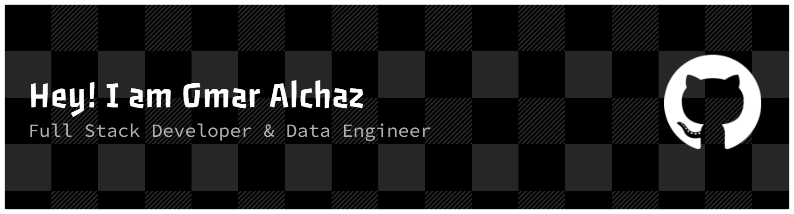

# 💫 About Me:
💻 I help businesses unlock insights as a Data Engineer 👨‍💻 Building data pipelines, cleaning & transforming big datasets, and developing forecasting & analytics models 🏋️‍♂️ Gym goer and martial arts enthusiast 🌍 Arabman in Greece  🔔 Follow my journey in data, Python, PySpark, and machine learning

# 💻 Tech Stack:

 

 

 

 

 

# 📊 GitHub Stats:
 
 

<h1 align="center">Hi 👋, I'm Omar Alhaz</h1>
<h3 align="center">A passionate Data Engineer from Athens</h3>

<h3 align="left">Connect with me:</h3>

<h3 align="left">Languages and Tools:</h3>

                      

